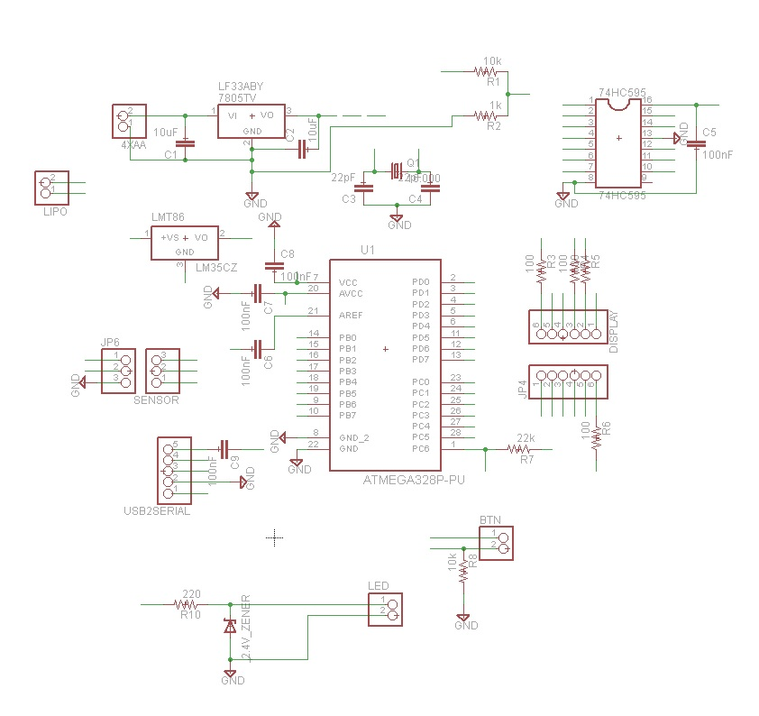
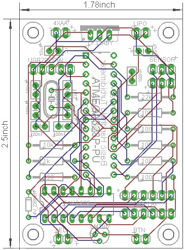

#Basic Handheld Turbidimeter
##Purpose  
The Basic Handheld Turbidimeter is designed to measure turbidity on demand, portably, for the lowest possible price.  

##Function  
_How does the device measure a parameter?_  
This device is a single-beam [nephelometrer](https://en.wikipedia.org/wiki/Nephelometer). Light from an infrared light-emitting diode (IR LED) is scattered by suspended sediment as it passes through a sample of water. This scattered light is detected by an IR-sensitive [photodiode](https://en.wikipedia.org/wiki/Photodiode) mounted at a right angle to the center of the IR LED's light beam. The intensity of light detected by the photodiode is referenced to a calibration curve stored in the device's memory to interpolate the corresponding turbidity value, measured in [nephelometric turbidity units (NTU)](http://or.water.usgs.gov/grapher/fnu.html).  

_How does the device record data?_  
This device is intended for basic manual operation and does not contain storage for data.   

_How does the device display data?_  
The microcontroller at the heart of this device reads the frequency of pulses transmitted by the [photodiode unit](http://www.mouser.com/ProductDetail/ams/TSL230BRD-TR/?qs=sGAEpiMZZMu97qiQi8P%252buifvOPr%252b402N67DKHn09PFo%3d), interpolates the turbidity value from stored calibration data, and displays the turbidity value on a [four-digit display panel](http://www.electrodragon.com/product/7-segment-4-digit-display-common-anode/) (much like those used in some alarm clocks).

_What units does the device report in?_  
Like all AWQUA turbidimeters, this device reports readings in  [nephelometric turbidity units (NTU)](http://or.water.usgs.gov/grapher/fnu.html).  

_How does the device communicate data electronically?_  
This device does not possess data telemetry capabilities.  

##Use Case  
_Where can the device be safely used?_  
This device can handle temperatures up to 70C, and is intended for field conditions. It is not water proof or water resistent, however.

##Power  
_How is the device powered?_  
This device uses 3.3V DC power, and requires less than 100mA of current. A standard 3.7V lithium ion or polymer battery, or three AA alkaline batteries, would suffice to power it.

_How much power does it use?_  
In semi-automated testing, this device was capable of taking 5000 measurements on one set of three AA batteries.

##Standard and Testing  
_How was the device tested?_  
Testing procedures for this device are described in full in [An Affordable Open-Source Turbidimeter](http://www.mdpi.com/1424-8220/14/4/7142).

_How did it perform?_  
Testing results for this device are described in full in [An Affordable Open-Source Turbidimeter](http://www.mdpi.com/1424-8220/14/4/7142). The figure below shows the performance of this model of device, versus a popular commercial turbidimeter.  

_What performance standards does the device meet?_  
This device was designed and successfully tested to reliably measure turbidity values well below 1.0 NTU, which is the maximum turbidity value recommended by the World Health Organization for drinking water prior to disinfection. Please note however that this device is not certified to meet EPA requirements for the routine turbidity monitoring of treated drinking water in the United States. 

_What monitoring standards can this device be used to meet?_  
This device is one of several proven turbidimeter designs out there that can be used to meet international and World Health Organization guidelines on turbidity monitoring, yet are not able to meet the very exacting (and expensive) American and European turbidity detection standards. There is an urgent global need for simple, affordable turbidity detection, and AWQUA members are working to establish alternative turbidity detection standards to address this need. Please check out our [Standards](https://github.com/AWQUA/Standards) repository for more information.

##Construction  

###Bill of Materials
| Quantity  | Part Description | Example Price (each) |
| :-------------: | ------------- | :-------------: |
| 1 | ATMega328P-PU microprocessor  | [$2.90](http://www.electrodragon.com/product/atmega328-with-arduino-optiboot-uno/)|
| 1 | 4-digit, 7-segment display  | [$2.10](http://www.electrodragon.com/product/7-segment-4-digit-display-common-anode/)|
| 1 | 74HC595 shift register  | [$0.62](http://www.mouser.com/ProductDetail/Texas-Instruments/SN74HC595N/?qs=sGAEpiMZZMuyBeSSR239IeaeNSzgQbS%2f1btldJdqa6k%3d) |
| 1 | LMT86 temperature sensor  | [$1.00](http://www.mouser.com/ProductDetail/Texas-Instruments/LMT86LP/?qs=sGAEpiMZZMvfFCidbTccA1jyVRrxk5nB%252bTEjPRynSGM%3d)|
| 1 | TSL230BRD  | [$4.83](http://www.mouser.com/ProductDetail/ams/TSL230BRD-TR/?qs=sGAEpiMZZMu97qiQi8P%252buifvOPr%252b402N67DKHn09PFo%3d)|
| 1 | LF33ABV 3.3V Voltage regulator  | [$1.03](http://www.mouser.com/ProductDetail/STMicroelectronics/LF33ABV/?qs=sGAEpiMZZMsGz1a6aV8DcBQiArhhid1gDswAeAw%2fIB0%3d)|
| 2 | 10uF aluminum electrolytic capacitors  | [$0.24](http://www.mouser.com/ProductDetail/Nichicon/ULD1J100MDD1TD/?qs=sGAEpiMZZMvwFf0viD3Y3c1N%2fF%2fpDmX12XlNW9X9Y3vZmYyMo5GpOw%3d%3d)|
| 2 | 22pF ceramic capacitors  | [$0.03](http://www.mouser.com/ProductDetail/Vishay-BC-Components/K220J10C0GF5UH5/?qs=sGAEpiMZZMsh%252b1woXyUXj9nJp%252b8gphztXIKBUu3gv%252bs%3d)|
| 5 | 100nF ceramic capacitors  | [$0.06](http://www.mouser.com/ProductDetail/Vishay-BC-Components/K104Z15Y5VE5TL2/?qs=sGAEpiMZZMsh%252b1woXyUXj5VNmf0jXPWIrWjnp1zAXac%3d)|
| 4 | 100 ohm resistors  | [$0.10](http://www.mouser.com/ProductDetail/KOA-Speer/MOS1-2CT52R101J/?qs=sGAEpiMZZMtlubZbdhIBICYVxaT5CDYBpEIIN%2f0BoAk%3d)|
| 1 | 220 ohm resistors  | [$0.10](http://www.mouser.com/ProductDetail/KOA-Speer/MOS1-2CT52R221J/?qs=sGAEpiMZZMtlubZbdhIBICYVxaT5CDYBStqm8FrIljg%3d)|
| 1 | 1K ohm resistors 1% tolerance | [$0.10](http://www.mouser.com/ProductDetail/Vishay-Beyschlag/MBB02070C1001FCT00/?qs=sGAEpiMZZMtlubZbdhIBIAA6NYEPHyksoxlYyK2s%252btM%3d)|
| 4 | 10K ohm resistors  | [$0.10](http://www.mouser.com/ProductDetail/Vishay-Beyschlag/MBA02040C1002FCT00/?qs=sGAEpiMZZMtlubZbdhIBIP7908E9uONJr6Tgqqo7oLA%3d)|
| 1 | IR LED  | [$0.47](http://www.mouser.com/ProductDetail/Kingbright/WP7113SF4C/?qs=sGAEpiMZZMvAL21a%2fDhxMro1KOf4QOs%252bCw5JRgjZK8o%3d)|
| 1 | LED lighting driver | [$0.54](http://www.mouser.com/Search/ProductDetail.aspx?R=AL5809-30S1-7virtualkey62110000virtualkey621-AL5809-30S1-7)|
| 1 | Momentary contact button  | [$0.91](http://www.mouser.com/ProductDetail/Mountain-Switch/104-0013-EVX/?qs=sGAEpiMZZMvxtGF7dlGNpr35VnaTB25ys95hy84%252ba4o%3d)|
| 1 | SPST power switch  | [$1.15](http://www.mouser.com/ProductDetail/CHERRY/TRG22F2FBBNN/?qs=sGAEpiMZZMtNT9UGfLL4eOd3cDQgL8vM5i2VNLX9H3E%3d)|
| 100 | Header pins (0.1" spacing)  | [$.00225](http://www.electrodragon.com/product/break-away-header/)|
|||
||**Total Cost:**|**$17.61**|
###Circuit Board
####Schematic

####Layout

###Assembly
For assembly instructions, see the [Supplementary Materials](http://www.mdpi.com/1424-8220/14/4/7142/s1) for An Affordable Open-Source Turbidimeter.  
##FAQ and Troubleshooting  
###Online Resources
